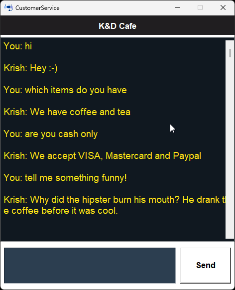

# Chatbot with Tkinter, NLTK, Numpy, Torch, and JSON

## Description
This project is a chatbot application built using Python libraries including Tkinter for the GUI interface, NLTK for processing and understanding human language text, Numpy for handling numerical operations efficiently, Torch for implementing machine learning models and JSON for storing and exchanging data.

## Features
- Interactive GUI using Tkinter.
- Natural Language Processing with NLTK.
- Machine Learning integration with PyTorch.
- Data storage and retrieval using JSON.

## Installation
### Prerequisites
Ensure you have Python installed on your machine. If not, download it [here](https://www.python.org/downloads/).

### Steps
1. Clone the repository:
   ```shell
   git clone https://github.com/yourusername/chatbot.git
   cd chatbot
   ```
2. Install the required packages:
    ```shell 
    pip install -r requirements.txt 
    ```
3. Run the application:
    ```shell 
    python main.py 
    ```

## Usage 
Interact with the chatbot via the graphical user interface provided by Tkinter. Type your message in the input field and receive instant replies from the bot.

## Contributing 
Pull requests are welcome. For major changes, please open an issue first to discuss what you would like to change.



